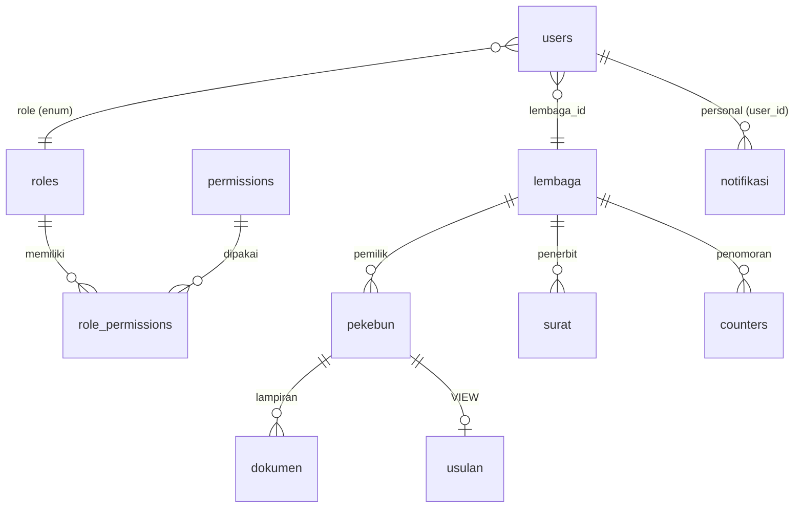
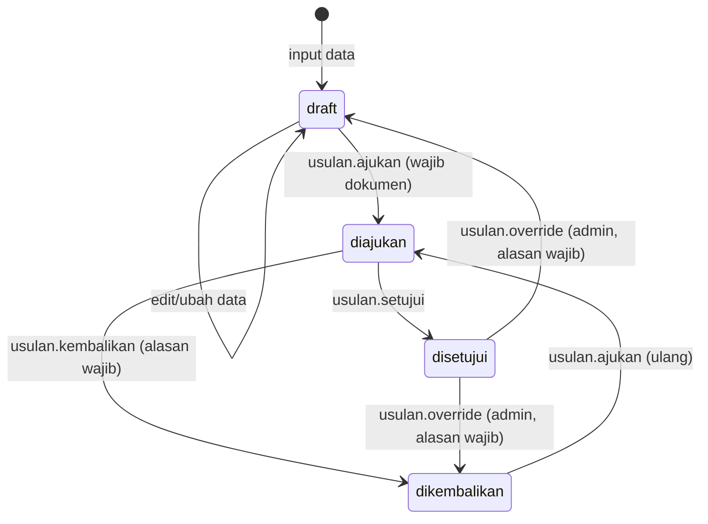

# DESAIN RBAC — Aplikasi Pelatihan SDMPKS

Dokumen ini menjelaskan desain **Role-Based Access Control (RBAC)**, alur verifikasi usulan, dan sistem notifikasi yang diterapkan pada Aplikasi Pelatihan SDMPKS (Surat Pernyataan Pelatihan SDMPKS).

## 1. Ringkasan

| Aspek | Deskripsi |
|---|---|
| Role | 3 role: **Administrator**, **Dinas Perkebunan**, **Lembaga Pekebun** |
| Izin | 18 izin granular, dikelompokkan per modul |
| Model data | Tabel `roles`, `permissions`, `role_permissions` + VIEW `usulan` (alias `pekebun`) |
| State machine | `draft` → `diajukan` → `disetujui` / `dikembalikan`, plus `dioverride` (riwayat) |
| Notifikasi | Broadcast per role atau personal per user, near real-time via polling 20 detik |
| Enforcement | Server-side di setiap endpoint API (`can()`), frontend hanya sebagai penyembunyian |

Prinsip utama: **semua keputusan keamanan dilakukan di backend**; UI hanya menyembunyikan elemen yang tidak relevan untuk role pengguna.

## 2. Skema Database (RBAC & Notifikasi)

### 2.1 Tabel `roles`

| Kolom | Tipe | Keterangan |
|---|---|---|
| `id` | INT PK | |
| `kode` | VARCHAR(20) UNIQUE | `admin`, `dinas`, `lembaga` |
| `nama` | VARCHAR(60) | Administrator, Dinas Perkebunan, Lembaga Pekebun |
| `deskripsi` | VARCHAR(255) | |
| `created_at` | TIMESTAMP | |

### 2.2 Tabel `permissions`

| Kolom | Tipe | Keterangan |
|---|---|---|
| `id` | INT PK | |
| `kode` | VARCHAR(60) UNIQUE | contoh: `usulan.setujui` |
| `nama` | VARCHAR(80) | |
| `kelompok` | VARCHAR(40) | dashboard, data, usulan, dokumen, surat, kelembagaan, akun, pengaturan |
| `deskripsi` | VARCHAR(255) | |

### 2.3 Tabel `role_permissions`

Relasi many-to-many `roles` ↔ `permissions` (PK gabungan `role_id` + `permission_id`, FK `ON DELETE CASCADE`).

### 2.4 Tabel `notifikasi`

| Kolom | Tipe | Keterangan |
|---|---|---|
| `id` | INT PK | |
| `user_id` | INT NULL | Personal (FK ke `users`, cascade); NULL = broadcast |
| `role_target` | VARCHAR(20) NULL | Broadcast ke seluruh pengguna role tsb. (`dinas`, `admin`, `lembaga`) |
| `judul` | VARCHAR(180) | |
| `pesan` | TEXT | |
| `tipe` | VARCHAR(12) | `info`, `sukses`, `peringatan`, `error` |
| `link` | VARCHAR(120) | Halaman tujuan saat item diklik (mis. `usulan`, `pengajuan`) |
| `dibaca` | TINYINT(1) | 0 = belum dibaca |
| `created_at` | TIMESTAMP | |

### 2.5 VIEW `usulan`

```sql
CREATE OR REPLACE VIEW usulan AS
SELECT p.*, COALESCE(l.nama_lembaga, "") AS lembaga_nama
FROM pekebun p
LEFT JOIN lembaga l ON l.id = p.lembaga_id;
```

VIEW ini memetakan konsep "usulan" (baris `pekebun` beserta nama kelembagaan pemilik) tanpa mengubah struktur tabel `pekebun` yang sudah dipakai modul lain (surat, cetak, ekspor).

### 2.6 ERD



## 3. Matriks Izin (18 Permission)

| Kode Izin | Admin | Dinas | Lembaga |
|---|:---:|:---:|:---:|
| `dashboard.lihat` | ✔ | ✔ | ✔ |
| `data.lihat` | ✔ | ✔ | ✔ |
| `data.tambah` | ✔ | – | ✔ |
| `data.ubah` | ✔ | – | ✔ |
| `data.hapus` | ✔ | – | ✔ |
| `data.import` | ✔ | – | ✔ |
| `usulan.ajukan` | ✔ | – | ✔ |
| `usulan.setujui` | ✔ | ✔ | – |
| `usulan.kembalikan` | ✔ | ✔ | – |
| `usulan.override` | ✔ | – | – |
| `usulan.riwayat` | ✔ | ✔ | ✔ |
| `dokumen.unggah` | ✔ | – | ✔ |
| `dokumen.hapus` | ✔ | – | ✔ |
| `surat.tambah` | ✔ | – | ✔ |
| `surat.hapus` | ✔ | – | ✔ |
| `lembaga.kelola` | ✔ | – | – |
| `akun.kelola` | ✔ | – | – |
| `pengaturan.ubah` | ✔ | – | ✔ |
| **Total** | **18** | **5** | **13** |

Catatan perilaku penting:

- **Dinas Perkebunan** adalah *verifikator pasif*: dapat melihat seluruh data (`data.lihat`) dan memutus usulan (`usulan.setujui`/`kembalikan`), tetapi **tidak dapat mengubah, menghapus, mengimpor, mengunggah dokumen, atau membuat surat**.
- **Admin** dapat melakukan *override* darurat: membuka kembali usulan berstatus **Disetujui** menjadi `draft`/`dikembalikan`, serta mengedit data pekebun yang terkunci (diajukan/disetujui).
- **Lembaga** adalah *pemohon*: pemilik data, penerbit surat, dan pengajak usulan. Tidak dapat menyetujui/mengembalikan usulan miliknya sendiri.

## 4. State Machine Alur Usulan



Aturan transisi:

1. **`draft` → `diajukan`** (Lembaga/Admin): harus memiliki minimal satu dokumen PDF terlampir.
2. **`diajukan` → `disetujui`** (Dinas/Admin): verifikator menyetujui.
3. **`diajukan` → `dikembalikan`** (Dinas/Admin): verifikator menolak/minta perbaikan; **alasan wajib** dan tersimpan di `alasan` + riwayat.
4. **`disetujui` → `draft`/`dikembalikan`** (Admin saja, `usulan.override`): dibuka kembali untuk perbaikan; **alasan wajib**; dicatat riwayat `dioverride`.
5. Data pekebun berstatus `diajukan`/`disetujui` **terkunci** dari edit/hapus oleh lembaga; hanya admin (dengan izin override) yang boleh menyentuhnya.

Aksi riwayat: `diajukan`, `disetujui`, `dikembalikan`, `diperbarui`, `dioverride`.

## 5. Implementasi Backend

### 5.1 Helper RBAC (`api/db.php`)

- `user_permissions(int $uid): array` — daftar kode izin user, di-cache statis per request.
- `fallback_permissions(string $role): array` — jaring pengaman berbasis role jika tabel RBAC belum termigrasi.
- `user_can(int $uid, string $perm): bool` — cek izin; menaikkan dari `fallback_permissions` saat tabel kosong.
- `can(string $perm)` — ambil user terautentikasi + validasi izin; gagal → JSON `{"ok":false,"error":"Akses ditolak."}` HTTP 403.
- `guard_role(?array $roles = null)` — validasi login (opsional batas role).

### 5.2 Penerapan per endpoint

| API | Izin | Perilaku |
|---|---|---|
| `dashboard.php` | `dashboard.lihat` (implisit) | statistik & ringkasan |
| `pekebun.php` | `data.lihat` (list), `data.tambah`/`data.ubah` (save), `data.hapus` (delete), `data.import` (import) | admin boleh override data terkunci; dinas otomatis ditolak |
| `berkas.php` | `usulan.ajukan`, `usulan.setujui`, `usulan.kembalikan`, `usulan.override`, `usulan.riwayat` | + pemicu notifikasi |
| `dokumen.php` | `data.lihat` (lihat/unduh), `dokumen.unggah` (upload), `dokumen.hapus` (hapus) | dinas hanya lihat/unduh |
| `surat.php` | `surat.tambah` (save), `surat.hapus` (delete) | lembaga diblokir hapus surat bila pekebun terkait berstatus `disetujui` |
| `users.php` | `akun.kelola` (kelola, reset password) | admin saja |
| `lembaga.php` | `lembaga.kelola` (save/delete), logo: `pengaturan.ubah` (lembaga) / `lembaga.kelola` (admin) | |
| `settings.php` | `pengaturan.ubah` (save & logo) | |
| `notifikasi.php` | autentikasi (bukan RBAC) | `list` / `count` / `baca` |

### 5.3 Helper notifikasi

- `kirim_notifikasi(string $roleTarget, string $judul, string $pesan, string $tipe, ?string $link, ?int $userId)` — menulis baris ke `notifikasi`.
- `kirim_notifikasi_lembaga(int $lembagaId, ...)` — lookup seluruh user lembaga pemilik, kirim personal ke masing-masing.

### 5.4 Pemicu notifikasi

| Aksi | Penerima | Link |
|---|---|---|
| Lembaga mengajukan usulan | Dinas + Admin | `usulan` |
| Usulan disetujui | Lembaga (pemilik) + Admin | `pengajuan` / `usulan` |
| Usulan dikembalikan | Lembaga (pemilik) + Admin | `pengajuan` / `usulan` |
| Admin override | Lembaga (pemilik) + Dinas | `pengajuan` / `usulan` |

### 5.5 Migrasi

`api/install.php` → `migrate_rbac(PDO $pdo)` — idempotent (`CREATE TABLE IF NOT EXISTS`, `INSERT IGNORE`, `CREATE OR REPLACE VIEW`), aman dijalankan berulang pada instalasi lama maupun baru.

## 6. Implementasi Frontend

### 6.1 Navigasi per role (`js/data.js` — `NAV`)

| Menu | Admin | Dinas | Lembaga |
|---|---|---|---|
| Dashboard | ✔ | ✔ | ✔ |
| Input Data | ✔ | – | ✔ |
| Surat-Surat | ✔ | – | ✔ |
| Cetak | ✔ | – | ✔ |
| Pengajuan Berkas | – | – | ✔ |
| Usulan Kelembagaan | ✔ | ✔ | – |
| Kelembagaan | ✔ | – | – |
| Akun Pengguna | ✔ | – | – |
| Pengaturan | ✔ | – | ✔ |
| Tentang Aplikasi | ✔ | ✔ | ✔ |

### 6.2 Modal Verifikasi (`js/berkas.js`)

- **Dinas**: form *read-only* (semua input `disabled`), tanpa tombol Simpan, tanpa unggah/hapus dokumen. Hanya tombol **Terima (Setujui)** / **Tolak (Kembalikan)** saat status `diajukan`.
- **Admin**: mode edit penuh + unggah dokumen pada status `diajukan`; saat status `disetujui` muncul tombol **Override (Buka Kembali)** yang membuka modal alasan dengan pilihan target status `dikembalikan` (pengajuan ulang) atau `draft` (edit langsung).
- Tombol **Edit/Hapus** pada daftar Usulan disembunyikan untuk dinas.

### 6.3 Bell Notifikasi (`js/notifikasi.js`)

- Polling `GET api/notifikasi.php?act=count` tiap **20 detik**; dijeda saat tab `hidden`.
- Badge merah menampilkan jumlah belum dibaca (`99+` jika > 99).
- Panel dropdown memuat 50 notifikasi terbaru (`?act=list`), di-render ulang saat panel dibuka atau ada notifikasi baru.
- Klik item → `POST ?act=baca` (per item) + navigasi ke halaman tujuan (`link`); tombol "Tandai Semua Dibaca" → `POST baca` tanpa id.
- Toast "Ada notifikasi baru." saat jumlah belum dibaca bertambah di tengah sesi.
- Gaya responsif: panel `max-width: calc(100vw - 32px)` agar aman di layar ≤640px.

## 7. Pengujian

### 7.1 Hasil uji CRUD (pra-RBAC)

42 kasus, 41 lulus. 1 kasus "gagal" justru membuktikan **FK `dokumen.pekebun_id → pekebun.id ON DELETE CASCADE`** bekerja (dokumen otomatis terhapus saat pekebun dihapus).

### 7.2 Rencana uji RBAC (harness `test_crud.ps1`)

| Kasus | Ekspektasi |
|---|---|
| Dinas `save` pekebun | HTTP 403 |
| Dinas `delete` pekebun | HTTP 403 |
| Dinas upload dokumen | HTTP 403 |
| Lembaga hapus surat saat pekebun `disetujui` | Ditolak |
| Admin `override` usulan `disetujui` (tanpa alasan) | Ditolak (alasan wajib) |
| Admin `override` → `draft` | OK + riwayat `dioverride` + notifikasi |
| Ajukan (lembaga) → `count` dinas bertambah → `baca` → `count` turun | Konsisten |
| Sesi tanpa izin (fallback) | `fallback_permissions` menjaga operasi dasar |

## 8. Catatan Rilis

- Cache versi aset: `?v=17` (CSS & JS) pada `dashboard.html`.
- Backup sebelum migrasi: `C:\Users\Acer\AppData\Local\Temp\opencode\backup-20260801-143926\` (dump `sdmpks_db.sql` + salinan folder aplikasi).
- Akun pengujian sementara `testcrud/test456` (role lembaga) dibuat untuk uji dan dihapus setelahnya.
